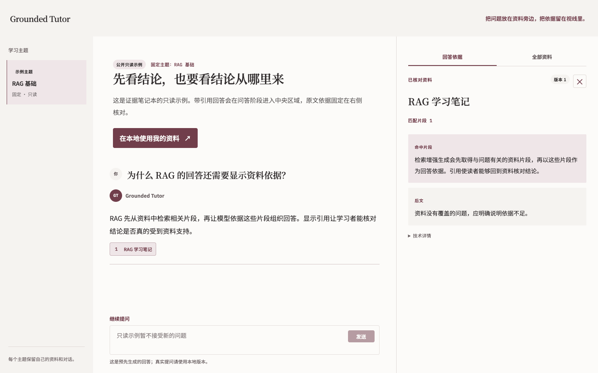

<div align="center">

# Grounded Tutor

### 围绕你的资料学习，让每个回答都有据可查。

导入讲义与笔记 · 核对原文引用 · 循序学习与练习

[](https://github.com/yidi000/grounded-tutor/actions/workflows/ci.yml)
[](LICENSE)

[快速开始](#快速开始) · [接入真实模型](#接入真实模型) · [完整部署指南](docs/local-development.md) · [反馈问题](https://github.com/yidi000/grounded-tutor/issues)

</div>



<p align="center"><sub>真实界面截图，使用项目自带的公开 RAG 示例；不含私人资料。</sub></p>

## 从「得到答案」到「理解资料」

Grounded Tutor 是一个在本地运行的学习工作区。把课程资料放进主题，围绕资料提问，再沿着引用回到原文核对。需要进一步学习时，可以进入小诊断、学习路径和理解检查。

| 提问与核对 | 学习与练习 | 资料与主题 |
| :--- | :--- | :--- |
| 回答带编号引用，点击查看原文片段 | 从小诊断生成有限的学习路径 | 上传文件或粘贴文本，先预览再接受 |
| 刷新后恢复问答与引用 | 阅读讲解，做题并查看反馈 | 各主题独立保存资料、历史与进度 |
| 依据不足时明确提示 | 暂停学习、追问，再继续原进度 | 创建、重命名和确认删除主题 |

## 快速开始

**准备：Python 3.12 / 3.13、Node.js 24、npm、Git、Make。** 以下命令适用于 macOS / Linux 的终端。

**1 · 下载并安装**

```sh
git clone https://github.com/yidi000/grounded-tutor.git
cd grounded-tutor
python3 -m venv .venv
.venv/bin/python -m pip install -e 'apps/api[test]'
npm --prefix apps/web ci
```

**2 · 初始化并启动后端**

```sh
test -f apps/api/.env || cp apps/api/.env.example apps/api/.env
.venv/bin/alembic -c apps/api/alembic.ini upgrade head
make api-dev
```

**3 · 新开一个终端，启动前端**

在同一个 `grounded-tutor` 目录运行：

```sh
VITE_APP_MODE=local npm --prefix apps/web run dev -- --host 127.0.0.1 --port 5173
```

打开 **http://127.0.0.1:5173**，创建主题，导入[示例资料](samples/rag-fundamentals/README.md)，复核后开始体验。

> 默认配置使用 **Fake 模式**：无需 API Key，适合体验流程，回答是固定测试内容。要让模型分析真实资料，请完成下面的配置。

## 接入真实模型

在本地 `apps/api/.env` 中设置 `EXTERNAL_MODE=live`，填写 FastGPT 和生成模型的连接配置，随后重启后端并创建新主题。

| 组件 | 负责什么 |
| :--- | :--- |
| **Grounded Tutor** | 页面、主题、历史、学习流程和本地数据 |
| **FastGPT** | 资料解析、整理和检索 |
| **生成模型** | 根据检索到的片段组织回答；可使用专用 FastGPT 应用或兼容端点 |

**[查看逐步配置指南 →](docs/fastgpt-generation.md)**

密钥只放在被 Git 忽略的本地 `.env`，不要填写到前端或提交到 GitHub。使用云端 FastGPT / 模型服务时，相关资料会发送到所配置的服务；本地运行不等于完全离线。

<details>
<summary><strong>只想查看界面，不启动后端？</strong></summary>

安装前端依赖后，运行：

```sh
VITE_APP_MODE=demo_read_only npm --prefix apps/web run dev -- --host 127.0.0.1 --port 5173
```

这是固定内容的本地只读示例，可查看引用；不提供上传、实时聊天或数据保存。

</details>

## 当前范围

本项目供**下载源码、本地单用户部署**，没有托管的在线服务。后端仅监听本机，使用一个 worker。

- 已支持桌面端；账号系统、移动端和图片解析暂未实现。
- 问答依赖已接受的资料；一般知识自由聊天与上传提醒仍在计划中。
- 保存历史不等于模型具有跨轮记忆，引用结构检查也不能保证模型语义完全正确。
- 删除主题会同时清理关联资料、对话与进度，请确认后再操作。

## 文档与开发

| 想了解什么 | 从这里开始 |
| :--- | :--- |
| 安装、运行、测试与环境限制 | [完整部署指南](docs/local-development.md) |
| 模型接入与 FastGPT 工作流 | [生成配置](docs/fastgpt-generation.md) |
| 数据流与技术实现 | [架构说明](docs/architecture.md) |
| 测试标准与测量结果 | [评估说明](docs/evaluation.md) · [公开评估快照](evals/reports/public-p0.md) |
| 密钥、资料与诊断信息的处理 | [安全与数据](docs/security-and-data.md) |
| 参与改进 | [贡献指南](CONTRIBUTING.md) · [Issues](https://github.com/yidi000/grounded-tutor/issues) |

代码采用 [MIT License](LICENSE)。项目自带示例资料采用 [CC0](samples/rag-fundamentals/README.md)。
