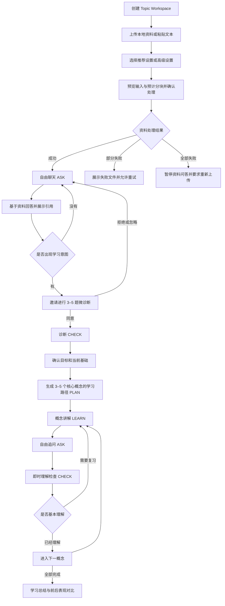
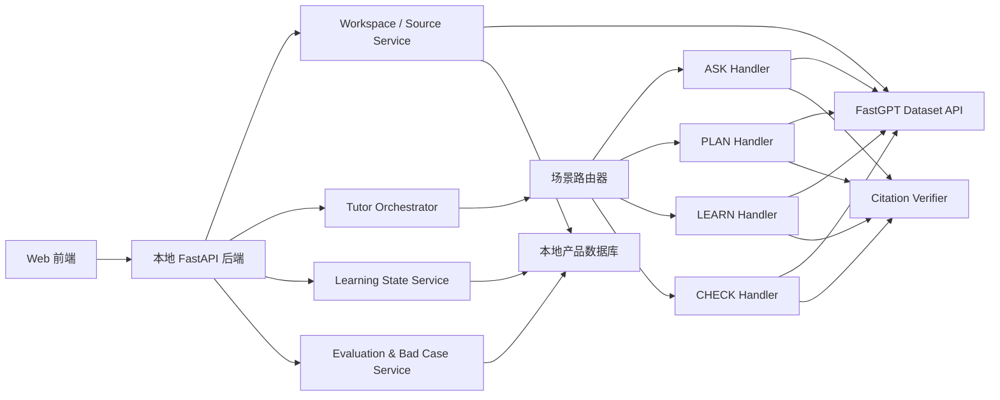

# Grounded Tutor 产品功能方案需求计划书

> 文档类型：产品需求与系统设计规格
>
> 版本：1.1
>
> 日期：2026-08-31
>
> 状态：已按书面复核意见修订，待最终确认
>
> 目标发布方式：GitHub 公开仓库，MIT License

## 1. 产品摘要

Grounded Tutor 是一个面向“已经拥有主题资料、需要复习或入门”的用户的个性化学习助手，第一核心场景是学生使用讲义、课堂笔记和阅读材料复习。用户为一个学习主题创建 Topic Workspace，上传一份或多份相关资料后，可以先自由提问。系统基于资料回答并展示引用；当识别到持续学习意图时，以非强制方式邀请用户完成微诊断，随后生成 3–5 个核心概念的学习路径，并通过 `LEARN → ASK → CHECK` 循环帮助用户从纯新手建立初步理解。

产品的资料获取顺序是：**用户上传的本地资料或粘贴文本为 P0 核心输入，单个网页导入和经授权的联网搜索为 P1 补充，整站抓取为条件式 P2 能力**。V1 不以“没有资料也能自动搜遍互联网”为核心价值。

产品采用“本地编排与状态管理 + FastGPT 知识库检索”的混合架构：FastGPT 负责文件解析、Chunk、Embedding、索引和检索，本地应用负责 Workspace、路由、学习状态、授权、引用验证、评测和产品界面。

## 2. 背景与机会

现有 BTB Teaching Assistant 1.0 Workflow 能完成固定领域的知识库问答：先改写问题，再分类到游戏介绍、操作问题、AI 知识或拒答分支；AI 知识库无结果时调用 Tavily 搜索。它证明了问题分类、知识检索、资料约束回答和外部搜索兜底的可行性。

但该 Workflow 仍是固定领域的问答流程，不能单独支持 Grounded Tutor 的目标：

- 知识库和分类均绑定 BTB 固定主题，不能动态管理用户主题。
- 没有 Workspace、资料版本和跨主题隔离。
- 没有诊断、学习路径、掌握状态和前后检查。
- 没有可暂停和恢复的跨场景活动状态。
- 外部搜索为自动兜底，不满足用户授权要求。
- 没有独立的引用验证、Bad Case 和可复现评测体系。

因此，现有 JSON 仅作为 `ASK` 能力的 V0 基线和效果对照，不直接扩展为最终产品。

Grounded Tutor 首先解决的不是“找不到资料”，而是“已有资料难以消化”：学生手中已有讲义、笔记、阅读材料或复习范围，但内容分散、缺少背景、无法快速定位答案，也缺少从自由提问过渡到诊断、学习路径和理解检查的连续体验。网页获取只在用户资料缺失或希望补充来源时使用。

## 3. 产品定位

### 3.1 一句话定位

面向已有主题资料的复习与入门用户，Grounded Tutor 让他们上传自己的材料、立即进行有引用的自由问答，并按需进入诊断、个性化路径、循序讲解和理解检查，建立初步且可验证的主题理解。

### 3.2 目标用户与优先级

**第一目标用户**

- 已有讲义、课堂笔记、阅读材料、复习提纲或习题解析，需要围绕一个课程主题复习的学生。
- 对该主题处于纯新手到初步理解阶段，希望先解决具体疑问、再决定是否系统学习的用户。

**第二目标用户**

- 已有行业报告、产品文档或专题文章，需要快速建立主题基础的职场学习者。
- 看重答案来源，希望严格区分自有资料结论与外部补充的用户。

**非优先用户**

- 没有任何主题资料、主要需要通用搜索或开放域聊天的用户。
- 需要完整课程管理、教师协作、长期记忆训练或专业资格认证的机构用户。

### 3.3 核心使用任务

1. 上传并组织某个主题的学习资料。
2. 对资料自由提问并查看引用。
3. 通过简短诊断确定学习起点。
4. 生成有限、可完成的学习路径。
5. 在讲解、追问和检查之间自由切换。
6. 查看已完成内容、理解表现和下一步建议。

## 4. 产品目标与非目标

### 4.1 产品目标

- 首次使用先交付一个有资料依据的回答，不用诊断阻塞用户。
- 让拥有讲义、笔记或阅读材料的用户在最短路径内完成上传、预览和第一次有引用的提问。
- 支持 `PLAN / LEARN / ASK / CHECK` 四类能力之间自然切换。
- 每个主要结论能够追溯到当前 Workspace 的资料或经授权的外部来源。
- 用户中断、追问或离开页面后，能够恢复原活动位置。
- 通过自动化场景集验证路由、引用、拒答、权限和状态连续性。
- 形成可运行、可评测、可公开复现的 GitHub 项目。

### 4.2 非目标

V1 不承担以下目标：

- 证明跨周知识保持或课程成绩提升。
- 覆盖所有学科的专业级教学质量。
- 建立完整的教师管理、多人协作、支付或订阅体系。
- 实现长期间隔复习、移动端 App 或自动抓取整个互联网。
- 把“没有资料也能进行通用问答或自动全网采集”作为 V1 主流程。
- 将模型推断的水平包装为精确能力分数。

## 5. 已确认的产品原则

1. **自有资料优先**：第一使用场景从本地文件或粘贴文本开始；网页获取不是创建 Workspace 的默认前提。
2. **自由聊天优先**：上传资料后先进入 `ASK`，不强制前测。
3. **诊断必须经用户同意**：系统可以邀请，不能自动打断聊天。
4. **一个 Workspace 对应一个学习主题**：可包含多份相关资料；不同主题不共享检索和学习状态。
5. **资料优先、联网需授权**：资料不足时先说明缺口，用户确认后才能联网。
6. **外部来源独立标注**：联网内容不自动加入知识库。
7. **学习增益采用微闭环验证**：前后检查聚焦 2–3 个概念，不要求完整学习周期。
8. **自动化评测为 MVP 必做**：少量真实用户测试是加分项，不阻塞发布。
9. **高影响操作必须确定性授权**：联网、开始诊断、重建路径和创建新主题不能只由模型决定。

## 6. 方案比较与选型

| 方案 | 优点 | 主要问题 | 结论 |
|---|---|---|---|
| 单一 FastGPT Workflow 增加全部分支 | 原型快 | 分支膨胀、状态复杂、测试困难 | 不采用 |
| ASK、PLAN、LEARN、CHECK 多个独立 Workflow | 模块相对清晰 | 上下文和进度同步困难 | 不作为目标架构 |
| 本地编排与状态管理，FastGPT 负责知识库检索 | 状态统一、可测试、易扩展、作品集价值高 | 本地开发量更高 | 采用 |

## 7. 端到端用户旅程



### 7.1 首次进入

1. 用户创建 Workspace，可输入主题名称或由首份资料生成建议名称。
2. 空 Workspace 的主操作是“上传本地资料”，次操作是“粘贴文本”；P1 才展示“导入网页链接”。
3. 用户可直接使用推荐处理设置，也可展开高级设置；确认前预览输入和预计分块，处理后再查看 FastGPT 的实际结果。
4. 界面逐份显示 `uploading / parsing / indexing / review / ready / failed`。
5. 至少一份资料 `ready` 后开放资料问答；回答只使用已就绪资料。
6. 用户直接进入聊天，可使用建议问题或自由提问。

资料入口保持一致：空 Workspace 显示上传引导，Workspace 顶部的“资料”抽屉支持持续管理，聊天输入区支持拖放文件或点击“添加资料”。无已就绪资料时不生成伪装成资料答案的普通模型回答。

### 7.2 从聊天进入学习

系统仅在以下情形发出诊断邀请：

- 用户明确表达“我是新手”“不理解”“应该怎么学”。
- 用户连续询问同一概念链中的多个基础问题。
- 用户主动要求学习路径或测验。

邀请卡片提供“开始诊断”和“继续提问”。用户拒绝或忽略后设置提醒冷却，不在短时间内再次展示。

### 7.3 学习循环

- `PLAN` 输出 3–5 个核心概念及顺序、学习目标和预计活动。
- `LEARN` 根据诊断结果调整解释深度，并引用用户资料。
- `ASK` 随时回答当前概念的追问。
- `CHECK` 使用一道即时题判断是否需要补充讲解。
- 完成全部概念后展示实际完成项、仍需复习项和前后检查差异。

### 7.4 返回 Workspace

用户再次进入时，系统展示最近活动和恢复入口，但不强制继续学习。用户可以选择继续上次步骤或直接自由提问。

## 8. 功能需求

### 8.1 Workspace 与资料管理

| ID | 需求 | 优先级 | 验收标准 |
|---|---|---:|---|
| FR-WS-01 | 创建、重命名、查看和切换 Topic Workspace | P0 | 切换后只加载对应资料、消息和进度 |
| FR-WS-02 | 一个 Workspace 支持多份资料 | P0 | 每份资料有独立状态和来源标识 |
| FR-WS-03 | Workspace 映射一个 FastGPT Dataset | P0 | 本地保存 `workspace_id → dataset_id` |
| FR-WS-04 | 资料映射 FastGPT Collection | P0 | 本地保存 `source_id → collection_id` |
| FR-WS-05 | 资料更新产生新的 `source_version` | P1 | 旧引用可识别为历史版本 |
| FR-WS-06 | 明显切换主题时建议新建 Workspace | P0 | 未确认前不迁移消息或资料 |

### 8.2 资料入口与处理设置

#### 8.2.1 入口和来源优先级

| 来源 | 入口 | 版本优先级 | 产品行为 |
|---|---|---:|---|
| 本地文件 | 空 Workspace、资料抽屉、聊天区拖放 | P0 | 支持 PDF、TXT、DOCX 等 FastGPT Dataset API 可处理格式 |
| 粘贴文本 | 空 Workspace、资料抽屉 | P0 | 用户输入标题和正文后进入同一处理流程 |
| 单个网页 URL | 资料抽屉 | P1 | 导入一个用户指定的静态网页并标注原始 URL |
| 临时联网搜索 | 资料无答案时的授权卡片 | P1 | 单次授权、只用于本次回答、不自动入库 |
| 同域整站同步 | 高级资料来源 | P2，条件式 | 仅在 FastGPT 版本和套餐支持时开放，并提示抓取范围与限制 |

上传采用四步流程：`选择来源 → 处理设置 → 数据预览 → 确认处理`。默认只显示推荐设置，避免普通学生必须理解 Chunk、Embedding 或索引参数；高级设置供希望控制知识库效果的用户展开。

本地产品的“数据预览”先展示原文、预计分块或预计问答对。由于 FastGPT 云端界面的预处理接口不一定作为稳定 OpenAPI 提供，FastGPT 完成处理后的 Collection 数据才是权威结果。FastGPT 当前以 Dataset 为最小搜索单位，因此不能假设检索 API 支持 Collection 白名单：处理期间由本地后端持有 Workspace 入库锁，Collection 创建后立即设置 `forbid=true`；Source 在用户复核前保持 `review`。用户接受后才设置 `forbid=false` 并转为 `ready`，不接受则修改设置并重新处理。

#### 8.2.2 推荐设置与高级设置

**推荐设置**

- 默认使用分块存储，按文档结构或系统默认规则分块。
- 默认加入标题索引；增强 PDF 解析、自动补充索引和图片索引仅在后端确认支持时展示。
- 系统根据文档类型给出参数建议，用户在预览页检查片段后确认。

**高级设置**

- 训练方式：分块存储 `chunk` 或问答对提取 `qa`。
- 分块方式：自动、按长度或按指定分隔符；可配置 `chunkSize`、`indexSize` 和 `chunkSplitter`。
- 索引增强：标题加入索引，以及能力检测通过后的自动补充索引和图片索引。
- 解析与模型：增强 PDF 解析；Workspace 创建时配置向量模型、生成模型和视觉模型。
- 问答对提取：允许编辑 `qaPrompt`，并在确认前预览生成结果。

高级表单只暴露 FastGPT 官方 Dataset OpenAPI 已公开且当前部署确实支持的字段。FastGPT 云端界面中未公开为稳定 API 的参数不在本地界面伪造；暂不支持的设置显示说明并允许用户跳转 FastGPT 管理端处理。

#### 8.2.3 配置归属

| 配置层级 | 代表参数 | 保存位置 |
|---|---|---|
| Workspace / Dataset | `vectorModel`, `agentModel`, `vlmModel` | Workspace 的 Dataset 配置 |
| Source / Collection | `trainingType`, `chunkSettingMode`, `chunkSplitMode`, `chunkSize`, `indexSize`, `chunkSplitter`, `qaPrompt` | Source 的 `ingestion_config` |
| Retrieval | 搜索模式、相似度、Token 上限、Rerank、问题优化 | Workspace 检索配置和评测运行记录 |

| ID | 需求 | 优先级 | 验收标准 |
|---|---|---:|---|
| FR-SRC-01 | 在空 Workspace、资料抽屉和聊天输入区提供一致的资料入口 | P0 | 三个入口进入同一上传任务和状态页 |
| FR-SRC-02 | 支持本地文件上传和粘贴文本 | P0 | 两类来源都生成 Source 和 FastGPT Collection 映射 |
| FR-SRC-03 | 使用四步资料处理流程 | P0 | 确认前不发起处理；失败可返回上一步 |
| FR-SRC-04 | 提供推荐设置和可折叠高级设置 | P0 | 默认路径无需调整参数；高级路径可重复同一份资料的配置 |
| FR-SRC-05 | 支持公开 API 范围内的分块、问答提取、索引增强和模型配置 | P0 | 请求参数、用户选择和最终入库配置可审计 |
| FR-SRC-06 | 处理前提供预计预览，处理后提供权威结果复核 | P0 | 入库锁释放前确认 Collection 已禁用；用户接受后才启用并转为 `ready` |
| FR-SRC-07 | 对商业版或未公开 API 能力进行检测和降级 | P0 | 不支持时不发送无效参数，并显示原因和替代入口 |
| FR-SRC-08 | 支持导入单个网页 URL | P1 | 保存 URL、抓取时间、网页标题和导入状态 |
| FR-SRC-09 | 支持同域整站同步 | P2，条件式 | 仅能力检测通过后开放，并显示页面上限、失败清单和版权提示 |

### 8.3 ASK：资料问答

| ID | 需求 | 优先级 | 验收标准 |
|---|---|---:|---|
| FR-ASK-01 | 对当前 Workspace 资料自由提问 | P0 | 只检索当前 `dataset_id`；非 `ready` Collection 均保持 `forbid=true` |
| FR-ASK-02 | 回答展示来源和对应片段 | P0 | 每条引用可关联 `source_id` 和片段 |
| FR-ASK-03 | 无资料支持时拒绝猜测 | P0 | 标准无命中用例不输出无依据强结论 |
| FR-ASK-04 | 根据用户语言回答 | P0 | 中文提问默认中文，英文提问默认英文 |
| FR-ASK-05 | 用户反馈回答有帮助或有问题 | P1 | 反馈关联消息、检索片段和路由 |

### 8.4 诊断邀请与用户画像

| ID | 需求 | 优先级 | 验收标准 |
|---|---|---:|---|
| FR-DIAG-01 | 从聊天识别学习意图 | P0 | 不触发时仍保持普通 ASK |
| FR-DIAG-02 | 诊断必须由用户明确同意 | P0 | 未确认时不创建诊断 Attempt |
| FR-DIAG-03 | 用户拒绝后设置提醒冷却 | P0 | 同一会话内不重复打扰 |
| FR-DIAG-04 | 模型推断与用户确认信息分开保存 | P0 | 推断信息不能直接覆盖确认字段 |
| FR-DIAG-05 | 微诊断包含 3–5 题 | P0 | 完成后输出知识点层级结果，不输出伪精确总能力分 |

### 8.5 PLAN：学习路径

| ID | 需求 | 优先级 | 验收标准 |
|---|---|---:|---|
| FR-PLAN-01 | 根据资料、目标和诊断生成路径 | P0 | 生成 3–5 个核心概念 |
| FR-PLAN-02 | 每个概念包含目标、资料依据和检查方式 | P0 | 缺少资料依据的概念不进入默认路径 |
| FR-PLAN-03 | 用户可调整顺序或跳过概念 | P1 | 已完成状态不因局部调整丢失 |
| FR-PLAN-04 | 重建路径必须经用户确认 | P0 | 确认前保留原路径 |

### 8.6 LEARN：循序讲解

| ID | 需求 | 优先级 | 验收标准 |
|---|---|---:|---|
| FR-LEARN-01 | 按当前水平讲解一个核心概念 | P0 | 输出定义、资料内解释、例子和检查入口 |
| FR-LEARN-02 | 支持“更简单、更多例子、更深入” | P0 | 保持同一 `active_concept_id` |
| FR-LEARN-03 | 讲解过程中允许自由追问 | P0 | ASK 结束后保留返回位置 |
| FR-LEARN-04 | 无资料依据时不扩展成确定性教学内容 | P0 | 提示资料缺口；仅在 P1 启用后显示联网授权入口 |

### 8.7 CHECK：理解检查

| ID | 需求 | 优先级 | 验收标准 |
|---|---|---:|---|
| FR-CHECK-01 | 支持微诊断和概念即时检查 | P0 | 两类 Attempt 分开记录 |
| FR-CHECK-02 | P0 使用可稳定判分的选择题或结构化题 | P0 | 答案与解释均有资料依据 |
| FR-CHECK-03 | 用户跳过时记录“未判断” | P0 | 不计为错误或掌握 |
| FR-CHECK-04 | 判分后解释依据并建议复习或继续 | P0 | 状态更新与答案写入保持原子性 |
| FR-CHECK-05 | 开放题语义评分与人工确认 | P1 | 不确定时显示参考答案而非强行判错 |

### 8.8 网页导入与联网补充

网页能力不属于首次使用必经流程，也不替代用户上传资料。P1 先支持用户明确提供的单个网页 URL；资料问答无依据时，再提供经用户授权的临时联网搜索。整站同步需要结合 FastGPT 部署版本、套餐能力、站点结构和内容授权判断，因此放在条件式 P2。

| ID | 需求 | 优先级 | 验收标准 |
|---|---|---:|---|
| FR-WEB-01 | 导入用户明确提供的单个网页 URL | P1 | 只抓取该 URL；预览后才索引 |
| FR-WEB-02 | 资料不足时提供临时联网入口 | P1 | 不自动发起请求 |
| FR-WEB-03 | 每次外部搜索前确认授权 | P1 | 未授权请求数为 0 |
| FR-WEB-04 | 外部内容单独标注 | P1 | 用户资料与外部来源视觉和数据字段均可区分 |
| FR-WEB-05 | 外部内容不自动进入知识库 | P1 | 保存前不影响后续检索 |
| FR-WEB-06 | 用户选择保存外部资料 | P1 | 经过确认、入库和索引后才成为 Source |
| FR-WEB-07 | 同域整站同步 | P2，条件式 | 仅支持的静态站点开放；展示抓取范围、失败页和停止入口 |

### 8.9 状态、恢复与记录

| ID | 需求 | 优先级 | 验收标准 |
|---|---|---:|---|
| FR-STATE-01 | 保存活动状态和返回检查点 | P0 | 追问后可恢复原题或原概念 |
| FR-STATE-02 | 跨页面会话恢复最近已完成步骤 | P0 | 未提交答案不写入掌握状态 |
| FR-STATE-03 | 高影响动作使用确定性状态转换 | P0 | 不由分类模型直接执行联网、重建或换主题 |
| FR-STATE-04 | 每次运行记录路由、检索和验证结果 | P0 | Bad Case 可完整重放输入与关键中间结果 |

## 9. 跨场景切换规则

| 当前场景 | 用户行为 | 系统处理 | 返回方式 |
|---|---|---|---|
| ASK | 普通资料问题 | 检索并回答 | 继续聊天 |
| ASK | 询问如何学习 | 发出诊断邀请 | 用户确认后进入 CHECK |
| ASK | 要求测验 | 根据当前概念生成题目 | 完成后回到聊天 |
| CHECK | 询问“为什么” | 暂停诊断并解释 | 显示继续原题入口 |
| CHECK | 跳过 | 记录未判断 | 进入下一题 |
| LEARN | 追问当前概念 | 临时进入 ASK | 回答后继续概念 |
| LEARN | 要求更简单或更深入 | 调整讲解 | 保持当前概念 |
| LEARN | 要求测验 | 进入即时 CHECK | 复习或进入下一概念 |
| 任意 | 切换无关主题 | 建议新 Workspace | 原状态保留 |
| 任意 | 没有已就绪资料 | 引导上传文件或粘贴文本 | 资料就绪后进入 ASK |
| 任意 | 资料不足且 P1 联网能力已启用 | 请求单次联网授权 | 搜索后返回原任务 |
| 任意 | 离开页面 | 保存已完成检查点 | 下次可恢复 |

### 9.1 路由优先级

1. 用户点击按钮等明确操作。
2. 当前正在进行的诊断或学习活动。
3. 用户明确表达解释、规划或测验意图。
4. 模型进行低风险场景分类。
5. 无法确定时默认 `ASK`。

### 9.2 最小活动状态

```text
workspace_id
source_version
active_mode
active_concept_id
suspended_activity
return_checkpoint
learning_plan_id
diagnostic_attempt_id
concept_status
web_search_consent
nudge_cooldown
```

## 10. 异常与可信度保护

| 异常 | 产品行为 |
|---|---|
| 文件不支持、损坏或加密 | 标记具体文件；其他文件继续；允许重试或删除 |
| 部分资料仍在索引 | 只使用已就绪资料并展示可用范围 |
| 检索无结果 | 说明资料不足，P0 提供继续上传；启用 P1 后再提供联网入口 |
| 结果相关度低 | 降低确定性，展示相关片段，不输出强结论 |
| 多份资料冲突 | 分别展示各资料说法和引用，不擅自裁决 |
| 结论无引用支持 | 自动重试一次；仍失败则删除结论或拒答 |
| 联网失败 | 保留问题和返回位置，允许重试或返回资料内回答 |
| FastGPT/API 超时 | 显示可恢复错误，不重复写入消息和进度 |
| 场景分类不确定 | 默认 ASK；高影响操作必须询问 |
| 文档包含提示注入 | 文档只作为资料，不执行其中的系统指令 |
| 资料更新或删除 | 增加版本；旧引用标记为历史；P1 支持刷新路径 |
| 页面关闭 | 保存已完成步骤；未提交答案不计入状态 |
| 自动判分不确定 | 展示参考答案，标记需要确认 |

### 10.1 引用保护流程

```text
生成结构化回答
→ 拆分主要结论
→ 检查每个结论是否有对应片段
→ 检查引用是否属于当前 workspace_id/source_version
→ 通过：返回
→ 未通过：重试一次
→ 仍未通过：删除无依据结论或明确拒答
```

### 10.2 失败写入规则

- 消息、Attempt 和活动状态采用幂等请求 ID。
- 只有 Handler 和引用验证均成功后才提交新的完成状态。
- 重试不重复创建消息、Attempt 或进度记录。
- 所有失败保留原 `return_checkpoint`。

## 11. 系统架构



### 11.1 组件职责

| 组件 | 职责 |
|---|---|
| Web 前端 | Workspace、资料状态、聊天、诊断卡片、路径、进度和引用展示 |
| FastAPI 后端 | API、安全校验、业务编排和产品逻辑 |
| Tutor Orchestrator | 加载状态、选择 Handler、暂停和恢复活动 |
| Route Policy | 确定性操作优先，低风险意图才使用模型分类 |
| 四个 Handler | 分别处理 ASK、PLAN、LEARN、CHECK |
| FastGPT | 文件解析、Chunk、Embedding、知识库索引和检索 |
| Generation Adapter | V0 调 FastGPT Chat API；V1 通过 OpenAI-compatible Adapter 调用所配置模型并生成结构化结果 |
| External Search Adapter | P1 中在用户单次授权后调用外部搜索，并把结果与 Workspace 资料分开标记 |
| Citation Verifier | 检查结论、引用、Workspace 和 Source Version |
| Learning State Service | 诊断、路径、概念和活动检查点 |
| Evaluation Service | 批量测试、指标、日志和 Bad Case |
| 本地数据库 | 保存产品数据，不充当向量库 |

### 11.2 单次消息数据流

```text
接收用户消息
→ 校验 workspace_id 和幂等 ID
→ 读取资料版本与活动状态
→ 根据路由优先级选择 Handler
→ 构建当前任务所需的最小上下文
→ 检索当前 FastGPT Dataset
→ Handler 生成结构化结果
→ 验证引用和权限
→ 原子化保存消息、Attempt 与状态
→ 返回内容、引用和下一步操作
```

### 11.3 渐进迁移

**V0：端到端连通**

- 使用一个预先配置的示例知识库和固定 Demo Workspace。
- 本地前端与 FastAPI 调用现有 FastGPT 应用 Chat API 完成 ASK。
- 只验证本地 UI → 后端 → FastGPT 的端到端连接、会话映射和基线效果。
- V0 不声称支持动态 Workspace 上传；该能力在 V1 通过 Dataset API 实现。

**V1：目标能力**

- 通过 FastGPT Dataset API 创建 Dataset、上传资料、配置已公开的处理参数并检索。
- 本地界面提供推荐/高级设置、预览、确认和逐文件处理状态。
- 本地四个 Handler 生成结构化结果。
- 本地完成路由、状态、引用验证和评测。
- BTB Workflow 保留为 ASK 基线，不保存真实密钥的公开版本。

## 12. 数据模型

| 实体 | 关键字段 | 说明 |
|---|---|---|
| Workspace | id, title, dataset_id, source_version | 一个学习主题 |
| Source | id, workspace_id, collection_id, source_type, origin_uri, status, version, ingestion_config | 一份上传、粘贴或导入的资料及其处理参数 |
| Conversation | id, workspace_id | Workspace 内的一段对话 |
| Message | id, conversation_id, role, mode, idempotency_key | 用户或系统消息 |
| ActivityState | workspace_id, active_mode, suspended_activity, checkpoint | 活动栈与恢复位置 |
| LearnerProfile | workspace_id, inferred_fields, confirmed_fields | 推断与确认信息分离 |
| LearningPlan | id, workspace_id, goal, status | 当前学习路径 |
| Concept | id, plan_id, order, status, evidence_refs | 核心概念 |
| Assessment | id, concept_id, type, answer_key, evidence_refs | 诊断或检查题 |
| Attempt | id, assessment_id, response, result, status | 用户作答 |
| Citation | id, message_id, source_id, source_version, chunk_ref | 结论来源 |
| SearchConsent | workspace_id, request_id, granted_at, scope | 单次联网授权 |
| EvaluationRun | id, dataset_version, metrics, config | 一次批量评测 |
| BadCase | id, run_id, category, trace, resolution | 可复现失败案例 |

P0 使用 SQLite；数据访问通过仓储接口隔离，稳定后可切换 PostgreSQL。

## 13. 评测与质量目标

### 13.1 评测层级

**必做：自动化系统评测**

- 构建 30–50 个脚本化案例。
- 覆盖路由、引用、拒答、授权、恢复、跨 Workspace 隔离和错误重试。
- 保存评测配置、输入、检索片段、输出和失败分类。

**可选：微学习人类测试**

- 3–5 名参与者。
- 每人 10–15 分钟。
- 3 道前测 → 5–8 分钟讲解与追问 → 3 道同知识点不同题目的后测。
- 只声称短时任务中的观察结果，不外推长期学习效果。

### 13.2 自动化评测目标

以下是验收目标，不是已经取得的结果：

| 指标 | 目标 |
|---|---:|
| 场景路由准确率 | ≥90% |
| 有依据结论的引用覆盖率 | ≥90% |
| 无资料案例正确拒答率 | ≥95% |
| 未授权联网请求（启用 P1 时） | 0 |
| 跨 Workspace 资料泄漏 | 0 |
| 核心端到端旅程 | 全部通过 |

### 13.3 核心端到端旅程

1. 新建 Workspace → 上传 → 提问 → 只引用当前资料。
2. 上传 → 调整处理设置 → 预览 → 确认 → 参数和结果可追溯。
3. 资料无答案 → 正确拒答 → P0 提供继续上传。
4. 同意诊断 → 完成诊断 → 生成有限路径。
5. 诊断中追问 → 解释 → 恢复原题。
6. 学习中测验 → 更新概念状态 → 继续或复习。
7. 切换 Workspace → 不携带另一主题资料和进度。
8. 引用验证失败 → 最多重试一次 → 保守输出。
9. 页面中断 → 恢复最近已完成位置。

P1 联网能力启用后增加：未授权联网 → 不发起外部请求；单页导入 → 预览确认 → 来源与用户资料明确区分。

### 13.4 简历与作品集表述边界

- 可以描述真实完成的架构、功能、评测规模和测得指标。
- 没有真实用户数据时，可以写“设计并实现微诊断和前后检查框架”。
- 只有完成真实测试后，才写具体参与人数和观察到的变化。
- 不把模型评分、测试目标或模拟数据写成用户学习成效。

## 14. MVP 范围

### 14.1 P0：必须完成

1. Workspace 创建、查看和切换。
2. 本地文件上传、粘贴文本及多资料解析、索引、失败状态。
3. 推荐/高级处理设置、处理前预计预览、处理后结果复核和配置审计。
4. 当前 Workspace 内的资料问答与引用。
5. 无资料或无命中时保守拒答并引导继续上传。
6. 非强制诊断邀请与冷却。
7. 3–5 题微诊断。
8. 3–5 个概念的学习路径。
9. `LEARN → ASK → CHECK` 闭环。
10. 活动暂停、恢复和跨会话进度。
11. 引用验证、幂等重试和 Bad Case。
12. 30–50 个自动化评测案例。
13. 可公开运行的 Demo、README 和评测报告。

### 14.2 P1：时间允许再做

- 更精细的水平推断和自适应题目。
- 开放题语义评分与人工确认。
- 单个网页 URL 导入。
- 经用户单次授权的外部搜索与独立来源标注。
- 将用户确认的外部资料保存到知识库。
- 能力检测通过后的自动补充索引和图片索引。
- 资料更新后自动刷新受影响路径。
- 检索阈值、混合检索和 Rerank 对比实验。
- 3–5 人微学习测试。

### 14.3 P2：条件式能力

- 同域静态网站整站同步；只有部署版本和套餐支持、用户有权导入且抓取范围可解释时实施。
- 不把整站同步完成度作为 Grounded Tutor 核心作品集的发布条件。

### 14.4 建议交付顺序

1. **Grounded ASK 基线**：Workspace、本地资料/文本输入、处理设置、预览、检索、回答、引用、拒答。
2. **可信与可评测**：引用验证、权限、日志、场景评测、Bad Case。
3. **学习闭环**：诊断、路径、讲解、即时检查、暂停恢复。
4. **开源发布**：README、示例资料、评测结果、CI、脱敏基线 JSON。

Grounded ASK 可以作为中途可演示版本；最终作品集至少跑通一次完整 `ASK → CHECK → PLAN → LEARN → CHECK` 旅程。

## 15. GitHub 开源发布方案

### 15.1 仓库目标结构

```text
grounded-tutor/
├── apps/
│   ├── web/
│   └── api/
├── evals/
├── fastgpt/
│   └── baseline.sanitized.json
├── docs/
│   ├── product-requirements.md
│   ├── architecture.md
│   └── evaluation.md
├── .github/workflows/
├── .env.example
├── .gitignore
├── LICENSE
├── CONTRIBUTING.md
└── README.md
```

### 15.2 开源规则

- 使用 MIT License。
- 不提交 FastGPT、模型或 Tavily API Key。
- 不提交用户资料、课程内部资料或无公开授权的文档。
- 现有 BTB JSON 不原样提交；移除 HTTP 密钥、账号关联 ID 和私有知识库信息后，作为基线示例发布。
- Demo 使用自行编写、合成或明确允许再分发的公开资料。
- `.env.example` 只包含变量名和说明，不包含真实值。
- README 区分目标指标和实测指标，并记录当前限制。

### 15.3 CI 与发布门禁

GitHub Actions 至少执行：

1. 后端单元和集成测试。
2. 核心场景评测。
3. 前端构建检查。
4. 密钥与敏感文件扫描。
5. 对公开基线 JSON 的敏感字段检查。

只有测试通过、示例数据授权清楚、密钥扫描无发现时才创建公开仓库或推送公开分支。

### 15.4 GitHub 连接与发布执行边界

- GitHub Pull Request 历史、Codex/ChatGPT GitHub 插件、GitHub CLI 登录和当前本地仓库的 Remote 是四种独立状态；已有 PR 记录不代表插件已经安装，也不代表当前仓库已经连接 Remote。
- GitHub 插件只用于在对话中读取或操作 GitHub，不是 Grounded Tutor 的产品功能、运行依赖或开源前置条件。
- 实际发布前单独检查：目标 GitHub 账号正确、CLI 或 Git 凭据有效、仓库 Remote 指向预期地址、推送分支无敏感信息。
- 创建远程公开仓库和首次推送属于外部发布动作，必须在代码、资料授权和密钥扫描完成后由用户明确确认。

## 16. 主要风险与缓解措施

| 风险 | 影响 | 缓解 |
|---|---|---|
| Chat-first 退化为普通 RAG 聊天 | 学习价值不明显 | 软诊断、路径、进度和活动恢复形成差异化闭环 |
| 意图路由错误 | 打断用户或更新错误状态 | 确定性操作优先；低置信度默认 ASK |
| 检索精度不稳定 | 回答无关或漏召回 | 评测集、Bad Case、Chunk 与检索参数实验 |
| 引用与结论不一致 | 可信度受损 | 结构化结论、引用验证和保守降级 |
| 功能范围过大 | 无法按期完成 | 按 Grounded ASK → 可信评测 → 学习闭环推进 |
| 产品退化为无资料的通用聊天或爬虫 | 目标用户和作品集价值失焦 | P0 只围绕用户已有资料；网页导入 P1，整站同步 P2 |
| 没有长期用户测试 | 无法声称学习成效 | 以系统指标为必做，微学习测试为加分项 |
| 网页导入越权或违反内容许可 | 版权、隐私和站点合规风险 | 用户明确提供来源；显示范围；遵守访问限制；不默认整站抓取 |
| 公开仓库泄露密钥或课程资料 | 安全与版权风险 | 脱敏基线、示例语料、CI 密钥扫描和发布门禁 |
| FastGPT 服务变化或不可用 | 核心链路中断 | Adapter 隔离、超时恢复、本地状态不依赖 FastGPT 聊天历史 |

## 17. 完成定义

产品设计阶段在以下条件下完成：

- 本文通过用户书面复核。
- 用户流程、功能范围、异常策略、架构、评测和开源边界无矛盾。
- 后续实现计划可以把 P0 拆成具体任务和验收命令。

产品 MVP 在以下条件下完成：

- P0 功能全部实现。
- 九条核心端到端旅程通过。
- 评测报告公开实际结果并保留失败案例。
- GitHub 仓库不含真实密钥、私有资料或未授权内容。
- README 能让第三方使用自己的 FastGPT 账号完成本地运行。

## 18. 官方能力依据

- [FastGPT Dataset OpenAPI](https://doc.fastgpt.io/zh-CN/openapi/dataset)：Dataset 创建、文件/文本/链接 Collection 和公开的处理参数。
- [FastGPT Web Site Sync](https://doc.fastgpt.io/zh-CN/guide/dataset/websync)：整站同步的版本、站点类型和页面范围限制。
- [FastGPT Dataset Search Engine](https://doc.fastgpt.io/zh-CN/guide/dataset/dataset_engine)：向量、全文、混合检索和 Rerank 的配置依据。
