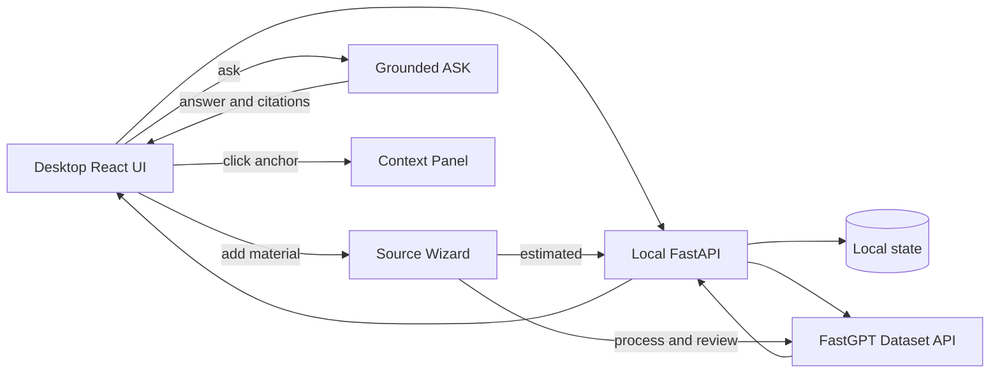

# Grounded Tutor Frontend Design Checkpoint

> 文档类型：桌面端产品界面与交互设计规格
>
> 日期：2026-09-02
>
> 状态：交互式评审与书面规格均已确认，可进入实施计划
>
> 适用范围：Foundation 前端、Learning UI 与相关 API 契约调整

## 1. 设计结论

Grounded Tutor 的第一视觉任务是让首次访问者在 10 秒内理解：

> 上传自己的学习资料，就能获得有引用、可核对的专属助教回答。

公开 Demo 默认进入一个已经准备好的 “RAG 基础” 示例 Workspace。用户可以立即体验预先生成的有引用问答；公开模式不接受上传、创建 Workspace 或其他持久写入。真实上传只在本地运行的开源版本中启用，公开模式的主操作是“在本地使用我的资料”。诊断、PLAN、LEARN 和 CHECK 是问答后的自然升级，不与核心价值争夺首屏注意力。Chunk、索引和 FastGPT 能力只出现在资料处理的高级设置或折叠技术详情中。

P0 采用桌面 Web 优先设计。验收视口为 `1280×720` 和 `1440×900`；两种视口都不得出现页面级横向滚动，中央对话区保持至少 640px，主题栏为 160–176px，上下文面板为 280–320px。移动端专属导航、底部引用面板、布局优化和移动端验收不属于当前范围；宽度小于 1280px 的体验不作为 P0 发布门槛。

## 2. 已选方向与未选方向

### 2.1 已选：Evidence Notebook

界面像一张会回应的学习桌：中央承载问题、答案和学习活动，右侧承载答案依据，左侧承载学习主题。关键结论旁使用可点击的 Evidence Anchor；点击后在右侧显示原文位置、片段和可用的上下文。

这个方向直接把“Grounded”变成可见的产品行为，同时避免界面退化成普通 AI Chat 或 FastGPT 管理后台。

### 2.2 未选方向

| 方向 | 未采用原因 |
|---|---|
| Focused Studio | 上手简单，但引用折叠在回答底部，容易看起来像普通 AI Chat |
| Learning Map | 学习闭环感强，但会让首次访问者误以为必须先诊断或选课程 |
| 长距离证据线 | 长对话中容易交叉、漂移和制造视觉噪音 |
| 四个 ASK / PLAN / LEARN / CHECK 页面 | 要求用户理解内部架构，并增加活动切换与恢复成本 |

## 3. 主工作区信息架构

桌面端采用一个连续工作区。以下结构表示本地完整模式：

```text
┌─────────────────────────────────────────────────────────────────────────┐
│ Grounded Tutor                    资料 · 2 已就绪   上传你的资料 ＋      │
├──────────────┬──────────────────────────────────────┬───────────────────┤
│ 学习主题      │ 中央连续活动区                       │ 上下文面板         │
│              │                                      │                   │
│ RAG 基础      │ 示例提示 / 对话 / 诊断 /             │ 回答依据           │
│ 统计学复习    │ PLAN / LEARN / CHECK                 │ 全部资料           │
│ + 新主题      │                                      │                   │
│              │ 活动恢复条                           │                   │
│              │ 固定聊天输入框                       │                   │
└──────────────┴──────────────────────────────────────┴───────────────────┘
```

### 3.1 顶栏

- 本地完整模式展示产品名、当前资料就绪数量、“资料”入口和主操作“上传你的资料”。
- 公开只读模式把主操作改为“在本地使用我的资料”，并链接到仓库运行说明。
- 不展示 Dataset、Collection、Embedding 或模型名称。
- 示例 Workspace 展示清晰的“示例主题”提示和“换成我的资料”入口。

### 3.2 学习主题栏

- 本地完整模式中桌面端常驻，用于创建、选择和重命名 Topic Workspace。
- 公开只读模式只显示一个不可编辑的示例主题，隐藏创建与重命名操作。
- 一个 Workspace 只对应一个学习主题。
- 切换 Workspace 不迁移资料、消息或学习活动。

### 3.3 中央连续活动区

- ASK 是默认状态。
- 诊断邀请、诊断题、学习路径、概念讲解和即时检查都使用同一个中央区域。
- 不显示 ASK、PLAN、LEARN、CHECK 四个顶部标签页。
- 聊天输入框始终可见。学习活动中的追问会暂停活动，并保存精确恢复点。
- 输入框上方的 Activity Dock 使用具体文案，例如“继续第 2 题”或“继续分块策略”。

### 3.4 上下文面板

- “回答依据”和“全部资料”共用一个右侧容器，避免多个抽屉叠加。
- 点击 Evidence Anchor 时自动切换到“回答依据”，并选中对应引用。
- 用户打开“资料”时切换到资料列表与管理操作。
- 中央区域始终是主要任务；右栏只展示上下文和次要管理信息。

## 4. 示例 Workspace 与首次体验

首次访问公开 Demo 时直接进入只包含版权安全、自编资料的 “RAG 基础” 示例 Workspace。公开部署使用 `demo_read_only` 模式，加载版本化的静态示例数据和预先生成的回答，不调用 Workspace、Source、Chat 或 Learning 的可写端点，也不保存访客输入。

首屏必须同时提供：

1. 一个已经完成的有引用示例回答。
2. 可点击的 Evidence Anchor 与引用上下文面板。
3. 明显的“在本地使用我的资料”主操作和仓库运行说明。
4. “示例主题”标签，避免用户误以为示例内容属于自己。

本地完整模式才允许创建真实 Workspace 和上传资料。创建后不再自动混入示例资料或示例对话。

公开 Demo 必须具备确定性的 seed/reset：每次构建从仓库中的固定 fixture 生成示例，刷新页面恢复同一初始状态。端到端测试必须证明 `demo_read_only` 模式不发出可写 API 请求。

## 5. 资料入口与处理流程

### 5.1 统一入口

以下入口打开同一个宽屏 Source Wizard：

- 空 Workspace 的“上传本地资料”和“粘贴文本”。
- 顶栏“上传你的资料”与“资料”面板。
- 聊天输入区的“添加资料”与文件拖放。

文件拖放只打开 Wizard 并带入文件，不静默开始上传或索引。

### 5.2 四步流程与实际复核

```text
选择资料 → 处理方式 → 预计片段 → 确认处理
                                      ↓
                              正在读取并整理资料
                                      ↓
                              实际处理结果复核
                                      ↓
                              接受并用于问答
```

- 预计结果明确标为“本地估算”。
- FastGPT 实际片段明确标为“实际处理结果”。
- 没有可靠的阶段事件时只显示“正在读取并整理资料”，不伪造 uploading、parsing、indexing 的动画进度。
- 用户点击“接受并用于问答”前，资料保持不可检索。
- 在同一个未刷新的 Wizard 会话中，文件和文本只保留在浏览器内存，可直接调整设置并重新处理。
- 页面刷新或稍后返回后，由于 P0 不保存原始内容，文件用户必须重新选择文件，文本用户必须重新粘贴内容。界面显示“重新选择原资料后处理新版本”，不承诺无输入重处理。
- 新处理产生新 Source 版本并保留旧引用历史。

### 5.3 格式能力

本地完整模式通过 `GET /api/capabilities/source-ingestion` 读取支持格式、上传上限和可用高级设置，不能把尚未实现的格式硬编码成可用状态。公开只读 Demo 使用同一类型的静态 capability fixture，并将上传能力标为关闭。

- 当前 Foundation 能力：PDF、DOCX、Markdown、TXT、HTML、CSV。
- Task 8A 通过解析、FastGPT 和 locator 验证后，才能逐项开放 PPTX、XLSX、PNG、JPEG、WebP；任务完成前这些格式不出现在可选择列表中。
- 单个网页 URL 属于 P1，不出现在 P0 的空 Workspace 主操作中。

能力响应至少包含：`accepted_extensions`、`max_upload_bytes`、`settings[{key, supported, disabled_reason}]`、`workspace_models[{key, supported, disabled_reason}]` 和 `read_only_demo`。`disabled_reason` 使用稳定公开 code，由前端映射为用户文案。

## 6. 推荐设置与高级设置

推荐设置是默认路径。普通用户不需要理解 RAG 参数即可生成预计片段。

高级设置按任务分组，而不是按 FastGPT 请求字段排列：

| 用户分组 | 设置 | 必须说明的影响 |
|---|---|---|
| 内容怎样被整理 | 保存方式、分段方式、片段长度、分隔符、QA 要求 | 原文片段或问答对；完整上下文与检索精度的取舍 |
| 内容怎样被检索 | 标题索引、索引内容长度 | 标题命中、关键词覆盖、索引噪音与成本 |
| 特殊资料处理 | 增强 PDF 解析 | 适用资料、额外成本和当前部署是否支持 |

每个字段直接显示：

1. 学生能理解的名称。
2. 这个设置负责什么。
3. 它会怎样影响处理或检索结果。
4. 推荐范围或使用场景。
5. 当前部署不支持时的禁用原因。

说明不能只存在于问号 Tooltip。FastGPT 部署未确认支持的能力必须禁用，且后端不得发送无效参数。图片内容索引是 P1 控件；Task 8A 只负责新增资料格式，不自动把图片索引设置提升为 P0。

### 6.1 Workspace 模型配置

本地完整模式只在“创建学习主题”中提供折叠的“模型配置（高级）”。默认使用系统配置，普通用户不需要填写模型 ID。

| 字段 | 用户说明 |
|---|---|
| 向量模型 `vector_model` | 决定资料如何转换为可检索表示；更换后通常需要重新建立资料索引 |
| 文本处理模型 `agent_model` | 用于问答对提取等资料处理能力，不等同于最终回答模型 |
| 图片理解模型 `vlm_model` | Task 8A 验证图片处理能力后，用于读取图片或扫描内容 |

这些字段只在 capability endpoint 标记支持时显示。输入值由部署者提供，界面不加载或猜测 FastGPT 的私有模型列表；每个字段都提供用途、影响和恢复系统默认值的操作。Workspace 创建后只读展示已选模型，P0 不支持修改；需要更换模型时创建新 Workspace，从而避免隐式重建全部资料索引。公开只读 Demo 不显示模型配置。

## 7. 引用与 Evidence Anchor

Evidence Anchor 依赖结构化回答，不在一段自由文本中计算字符偏移。ASK 浏览器响应使用以下形状：

```json
{
  "answer_blocks": [
    {
      "id": "block-1",
      "kind": "answer",
      "text": "片段过大时容易混入不相关内容。",
      "citation_ids": ["citation-1"]
    }
  ],
  "citations": [
    {
      "id": "citation-1",
      "source_id": "...",
      "source_name": "RAG Fundamentals.pdf",
      "source_version": 1,
      "chunk_id": "chunk-18",
      "excerpt": "...",
      "context_before": null,
      "context_after": null,
      "locator": {"kind": "pdf", "page": 12, "section": "2.3 Chunk boundaries"}
    }
  ]
}
```

每个 `answer_block` 是可独立渲染的结论或段落，并用稳定 `citation_ids` 指向经过本地 READY Source 验证的引用。前端在 block 末尾渲染编号锚点；不使用容易因 Markdown 或语言变化而失效的字符 offset。

`GroundedContentBlock{id, kind, text, citation_ids}` 是 ASK、LEARN 和 CHECK 共用的公开类型，`kind` 必须是 `answer | definition | explanation | example`：

- ASK 返回 `answer_blocks`，`kind="answer"`。
- LEARN 返回 `content_blocks`，`kind` 取 `definition`、`explanation` 或 `example`。
- CHECK 的判分说明返回 `explanation_blocks`，`kind="explanation"`。

后端必须拒绝 dangling citation ID 和缺少引用的事实性 block。生成结果先验证一次；失败时只允许一次受控重试。再次失败后删除不受支持的 block；如果没有剩余可支持结论，返回 `insufficient_material`，不能把未验证文本交给浏览器。

### 7.1 交互规则

- 每条回答拥有自己的引用编号范围。
- Evidence Anchor 位于它支持的结论旁边，不绘制跨消息的永久连接线。
- 点击锚点后高亮对应结论，并在右侧显示引用详情。
- 关闭或切换引用后，焦点返回原 Evidence Anchor。

### 7.2 引用详情

P0 保证展示：

- Source 名称与版本。
- 命中片段。
- Chunk ID，放在折叠的技术详情中。
- 可靠时展示结构化位置。

`context_before` 和 `context_after` 是可选字段。只有 FastGPT 结果或受限的相邻片段查询能够可靠提供时才显示；P0 不把前后文承诺为每条引用必有内容。

位置标签按资料类型表达：

| 类型 | 可显示位置 |
|---|---|
| PDF | 页码、章节标题 |
| DOCX | 标题路径、段落 |
| PPTX | 幻灯片编号、标题 |
| XLSX | 工作表、单元格范围 |
| 图片 | 文件名；只有可靠时才显示区域 |
| Markdown / TXT | 标题、段落或片段编号 |

`locator` 是可辨别 union；没有页码或结构元数据时使用 `{"kind":"chunk","label":"片段 18"}`。`chunk_id` 仍是折叠技术详情中的不透明标识，不能直接冒充用户可读的片段编号。系统绝不推测页码或章节。

### 7.3 P0 边界

P0 不要求保存原始文件，不内嵌 PDF、PPTX 或 Office 文档查看器。“打开原资料对应页”是后续增强，只有在原文件可用或提供方存在稳定深链能力时开放。

## 8. ASK 到学习闭环

### 8.1 诊断邀请

- 邀请是聊天内卡片，不使用 Modal。
- 文案提供“开始诊断”和“继续提问”。
- 未明确同意时不创建诊断。
- 拒绝或忽略后遵守冷却时间。

### 8.2 微诊断

- 显示真实题数与进度，例如“快速诊断 2/4”。
- 始终提供“跳过这题”和“退出诊断”。
- 跳过显示为“未判断”，不计为错误。
- 聊天输入框保留；提问时暂停当前题目。

### 8.3 PLAN

- 中央区域展示 3–5 个有资料依据的概念。
- 每个概念展示目标、状态和开始操作。
- P0 不展示调整顺序；概念重排属于 P1。完全重建仍必须再次确认。
- `LearningPlanCard` 的次级菜单提供“重建学习路径”。点击后打开确认对话框，说明现有路径会保留为历史版本，并提供“取消”和“确认重建”。取消不发请求且焦点返回触发按钮；确认后旧路径保持可用，只有新路径创建成功才切换。

### 8.4 LEARN 与 CHECK

- 讲解展示关键定义、解释、例子和 Evidence Anchor。
- “更简单、更多例子、更深入”保持当前 Concept。
- “检查理解”在讲解中自然出现，不自动强制进入。
- 检查完成后解释依据，并明确“复习当前概念”或“进入下一概念”。
- 中途 ASK 返回后显示具体恢复操作。

### 8.5 建议新主题

当系统判断问题明显属于另一个主题时，聊天中显示 `WorkspaceSuggestionCard`，提供“创建新学习主题”和“留在当前主题”。卡片只展示建议名称，不自动创建、切换或移动资料与消息；用户确认创建后才调用 Workspace API。拒绝后继续当前 ASK，不修改学习活动。

## 9. 视觉系统

### 9.1 颜色

| Token | 色值 | 职责 |
|---|---|---|
| Ink | `#172A32` | 主要文字与高对比表面 |
| Lecture Blue | `#2E5E78` | 主要操作、选中状态 |
| Chalk | `#F7FAFB` | 内容表面 |
| Desk Mist | `#E8EDF0` | 页面背景与工作区边界 |
| Highlighter | `#D9E65B` | Evidence Anchor 与当前证据高亮 |
| Proof Green | `#3A7964` | 已就绪、正确与验证通过 |
| Correction Red | `#B4554D` | 错误、失败与需要修正；始终配合文字和图标 |

Correction Red 是功能性状态色，不用于装饰或大面积背景。

### 9.2 字体

- `@fontsource/noto-sans-sc`：本地构建加载 400、600、700；用于导航、操作、普通正文和表单。回退为 `PingFang SC, Microsoft YaHei, sans-serif`。
- `@fontsource/noto-serif-sc`：本地构建加载 600、700；用于教学结论与概念标题。回退为 `Songti SC, SimSun, serif`。
- `@fontsource/ibm-plex-mono`：本地构建加载 500、600；用于来源位置、页码、Chunk ID 和技术详情。回退为 `SFMono-Regular, Consolas, monospace`。

字体通过应用构建产物自托管，不依赖运行时访问 Google Fonts 或其他第三方字体 CDN。三个 Fontsource 包及其字体许可证随开源依赖清单保留。

### 9.3 形状与间距

- 卡片圆角 8–12px。
- 只有状态和引用编号使用完整圆形或胶囊形。
- 使用 4、8、12、16、24、32 的间距序列。
- 不使用大面积发光渐变、玻璃拟态或无内容含义的装饰。

### 9.4 动效

唯一强调动效是点击 Evidence Anchor：当前结论高亮，右侧上下文切换，持续约 180ms。

其他状态只使用必要的淡入或进度反馈。系统必须遵守 `prefers-reduced-motion`，减少动画时不影响信息理解。

## 10. 组件边界

| 组件 | 单一职责 |
|---|---|
| `AppShell` | 桌面三栏布局与顶栏 |
| `DemoModeBanner` | 区分公开只读示例与本地完整模式 |
| `TopicRail` | 本地完整模式的 Workspace 创建、选择和重命名；公开模式的单一示例标签 |
| `ConversationSurface` | ASK 消息与结构化学习活动容器 |
| `Composer` | 自由提问与添加资料入口 |
| `ContextPanel` | “回答依据”和“全部资料”两个上下文视图 |
| `EvidenceAnchor` | 打开某个结论对应的引用详情 |
| `SourceWizard` | 资料选择、设置、预计预览、确认和实际复核 |
| `ActivityDock` | 显示暂停活动与精确恢复操作 |
| `DiagnosticCard` | 邀请、题目、跳过和退出 |
| `LearningPlanCard` | 3–5 概念、状态和重建确认入口 |
| `LessonCard` | 概念讲解、深度控制和检查入口 |
| `CheckCard` | 题目、提交、解释与下一步 |
| `WorkspaceSuggestionCard` | 请求用户确认是否为无关主题创建新 Workspace |

每个组件通过显式 props 和 API 类型通信，不读取其他组件内部状态。

`AppShell` 唯一拥有 `ContextPanel`，`ConversationSurface` 唯一拥有共享 `Composer`。Task 10 只向 `ContextPanel` 注册资料视图，Task 11 注册引用视图，Learning UI 复用同一个 `Composer`；不得分别创建 Source Drawer、Citation Drawer 或 Lesson Composer。

## 11. 数据流与后端契约影响



前端实现依赖以下契约：

- 新增公开、只读的 Source capability endpoint，返回格式、上传上限、高级字段、禁用原因和只读 Demo 状态。
- ASK 返回 `answer_blocks[].citation_ids` 与 `citations[]`，Citation 增加可选结构化 `locator`、`context_before` 和 `context_after`。
- Source 状态和错误使用下节列出的稳定公开 code；页面不解析内部异常文案。
- 学习活动返回明确 mode、checkpoint 和 suggested action；高影响操作仍需显式 UI 事件。
- `demo_read_only` 配置必须在 API 层拒绝所有可写路由，而不只是在界面上隐藏按钮。

## 12. 空状态、错误和恢复

| 状态 | 主文案 | 主操作 | 次操作 |
|---|---|---|---|
| 空 Workspace | 先添加一份学习资料 | 上传本地资料 | 粘贴文本 |
| 无 READY Source | 至少一份资料准备好后才能提问 | 检查处理结果 | 添加资料 |
| 处理中 | 正在读取并整理资料 | 无 | 关闭并稍后查看 |
| 待复核 | 检查系统实际读到的内容 | 接受并用于问答 | 调整设置并重新处理 |
| 处理失败 | 这份资料没有处理成功 | 重新处理 | 调整设置、移除资料 |
| 资料不足 | 当前资料不足以支持这个答案 | 添加相关资料 | 换一种问法 |
| 外部服务暂不可用 | 当前无法完成这项操作 | 重试 | 保留输入并返回 |

失败界面不展示 FastGPT 名称、Dataset ID、Collection ID、密钥、堆栈或原始响应。

### 12.1 稳定公开状态与错误 code

| Code / status | 前端行为 |
|---|---|
| `insufficient_material` | 作为 Chat 状态渲染资料不足卡片，不作为异常 Toast |
| `request_body_too_large`, `file_too_large`, `text_too_large`, `source_too_large`, `source_work_limit_exceeded` | 保留用户输入并提示缩小资料 |
| `unsupported_file_type` | 返回资料选择页并显示 capability endpoint 提供的格式 |
| `unsafe_archive` | 拒绝文件并提示重新导出或选择其他版本 |
| `invalid_chunk_settings` | 保留表单并定位到无效设置 |
| `workspace_ingestion_busy` | 提示当前主题已有资料在处理，不自动重试 |
| `processed_preview_unavailable` | 保持 Source 状态，提供稍后重试或重新选择原资料 |
| `invalid_source_transition` | 刷新 Source 状态，禁用不再适用的操作 |
| `empty_processed_source` | 禁止接受并提示调整设置或更换资料 |
| `workspace_not_found`, `source_not_found` | 返回有效 Workspace 或资料列表 |
| `demo_read_only` | 公开 Demo 引导到本地运行说明，不提交写请求 |
| `external_service_error` | 保留输入并提供手动重试 |
| `persistence_error` | 保留输入，显示通用本地保存失败，不自动重放写操作 |

Foundation Task 7、Task 8 和 capability endpoint 的实施计划必须把新增 code 写入 Pydantic/TypeScript union，并为 API 与组件映射添加契约测试。

## 13. 桌面端质量契约

### 13.1 可访问性

- Tab 顺序与视觉顺序一致。
- Evidence Anchor、标签、按钮和诊断选项均可使用键盘。
- 右侧面板关闭后焦点返回触发元素。
- 所有图标有可读名称，所有状态同时使用文字。
- 正文、操作和状态达到可读对比度。
- `prefers-reduced-motion` 下禁用非必要动画。

### 13.2 组件测试

必须覆盖：

- 示例与空 Workspace。
- 公开只读 Demo 只有一个不可编辑主题，不显示创建、重命名或上传控件，也不调用可写端点；本地完整模式才显示这些操作。
- 资料预计预览、处理中、实际复核、失败和 READY。
- 高级设置说明、推荐值、验证和部署能力禁用。
- 结构化回答 block、Evidence Anchor 映射、引用切换和无资料拒答。
- 诊断邀请、拒绝、题目跳过、PLAN 重建确认/取消、LEARN `content_blocks` 和 CHECK `explanation_blocks` 各自的 Evidence Anchor/引用映射、暂停和恢复。
- 无关主题建议卡片的创建确认与拒绝路径。

### 13.3 桌面浏览器旅程

至少验证：

1. 公开模式打开固定示例 Workspace，查看引用，点击“在本地使用我的资料”，并确认没有可写 API 请求。
2. 本地完整模式上传或粘贴资料，确认预计片段，复核实际结果并接受。
3. 本地完整模式自由提问，点击 Evidence Anchor 查看来源。
4. 表达学习意图，同意诊断并生成路径。
5. 学习中追问，然后恢复原题或原概念。
6. 在 `1280×720` 与 `1440×900` 检查三栏无页面级横向滚动，中央区域不窄于 640px。

移动端浏览器旅程不属于本阶段验收。

## 14. 对现有实施路线的调整

书面规格批准后，实施计划需要更新但保持现有阶段顺序：

| 现有任务 | 必须加入的设计要求 |
|---|---|
| Foundation Task 7 | 重处理请求重新携带文件或文本；版本血缘、软删除、空实际结果拒绝和新增错误 code |
| 新 Foundation Task 7A | 审计 Tasks 5–7 的稳定公开 error union；实现 `GET /api/capabilities/source-ingestion`、Workspace 模型能力、`demo_read_only` API 强制、fixture 与契约测试 |
| Foundation Task 8 | `answer_blocks[].citation_ids`、Citation locator/可选上下文、READY 映射；测试 dangling ID、无引用事实 block、单次重试、删除不支持 block 与保守拒答 |
| Foundation Task 8A | 在 Task 9 前写出完整 PPTX/XLSX/图片解析、locator、capability 与测试步骤；验证通过前不开放格式 |
| Foundation Task 9 | Evidence Notebook tokens、桌面 AppShell、公开单一不可编辑 TopicRail、只读示例入口、共享 ConversationSurface/Composer/ContextPanel |
| Foundation Task 10 | 宽屏 Source Wizard、字段说明、能力禁用、实际复核、创建时模型配置与创建后只读值；资料视图注册到共享 ContextPanel，不创建 Source Drawer |
| Foundation Task 11 | Evidence Anchor、结构化回答 block、资料不足状态、桌面 E2E；不创建独立 Citation Drawer |
| Learning Task 5 | LEARN `content_blocks` 与 CHECK `explanation_blocks` 共用 GroundedContentBlock，并执行同一引用验证与保守拒答 |
| Learning Task 7 | 复用 ConversationSurface 与 Composer，加入 Activity Dock、WorkspaceSuggestionCard、PLAN 重建确认/取消和桌面学习闭环 E2E |
| Release Phase | 静态示例 seed/reset、只读模式无写请求测试、本地完整模式演示说明 |

Task 7 的接受、重处理版本血缘和软删除仍先于依赖它的完整资料管理界面。Task 7A 和完整 Task 8A 也必须在相应前端实现前完成。书面规格获批后先修订实施计划，不直接开始前端代码。

## 15. 后续账号密码阶段

P0 开源版本完成后新增独立的 Account & Cloud Workspace 阶段。目标是让公开部署支持账号密码、个人 Workspace 与持久资料，而不是继续使用共享单用户数据模型。

该阶段必须先完成单独的安全与产品设计，至少覆盖：

- 用户注册、登录、退出、密码重置和会话失效。
- 密码只通过成熟认证库或托管认证服务进行加盐哈希与验证，应用不保存明文密码。
- Workspace、Source、Conversation、Message 和全部 Learning 状态增加 `owner_id`，所有读写查询强制按当前用户隔离。
- 上传限额、速率限制、远端 Dataset/Collection 清理、账号删除和资料删除。
- 安全 Cookie、CSRF/同源策略、登录爆破防护和审计测试。
- 本地单用户数据不会自动同步到云端账号；迁移需要后续显式导入设计。

在该阶段通过跨账号隔离测试前，公开 Demo 继续保持只读。

## 16. 明确延期

以下内容不是未决定事项，而是明确延期：

- 移动端专属设计和验收。
- 内嵌原始 PDF、Office 或图片查看器。
- 长期保存用户原始文件。
- 单网页导入、联网搜索和整站抓取。
- 自动展示 FastGPT 内部处理阶段。
- 未经能力检测的图片索引、OCR 或视觉模型开关。
- 账号密码与云端持久 Workspace；它们由第 15 节定义的后续独立阶段实现。

## 17. 完成标准

Frontend Design Checkpoint 在以下条件下视为完成：

- 第一视觉任务、示例入口和桌面信息架构被书面确认。
- Source Wizard、设置说明、预计/实际结果区分被实现计划覆盖。
- Evidence Anchor、引用位置真实性和 P0 查看器边界明确。
- ASK 到诊断、PLAN、LEARN、CHECK 的连续活动方式明确。
- 视觉 tokens、组件边界、错误状态和桌面质量门明确。
- 公开 Demo 只读边界、结构化回答与 capability/error 契约明确。
- 账号密码被登记为 P0 之后的独立安全设计阶段。
- 实施计划更新前不开始前端代码。
